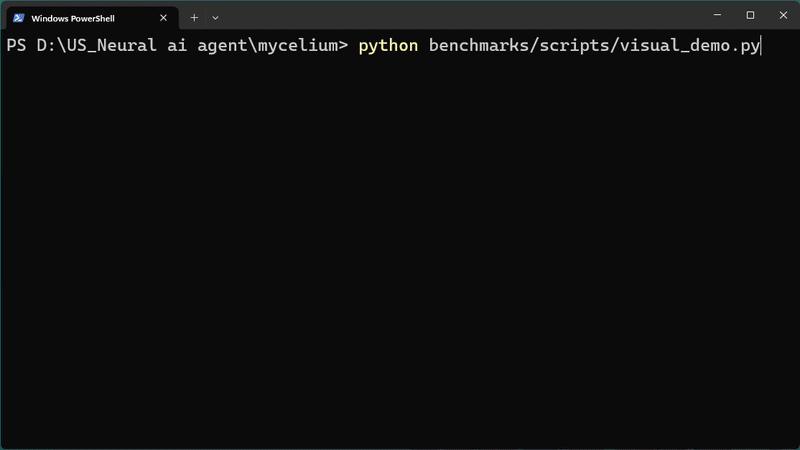

<div align="center">

# 🍄 Mycelium Agents

### The Semantic Edge Routing Protocol for Agentic Workflows

[](https://github.com/udaysaai/mycelium/actions)
[](https://pypi.org/project/mycelium-agents/)
[](https://www.npmjs.com/package/mycelium-js)
[](https://pypi.org/project/mycelium-agents/)
[](LICENSE)

[](benchmarks/)
[](scripts/system_check.py)
[](security/auth.py)

**[▶ Live Dashboard](https://mycelium-agents.netlify.app)** • **[Technical Report](docs/arXiv_draft.md)** • **[Benchmarks](benchmarks/RESULTS.md)**

</div>

<div align="center">
  
</div>

**Bypass the 2000ms Cloud LLM Routing Tax. Scale your agentic architecture from 5 to 100,000 specialized tools with sub-10ms intent discovery and zero prompt drift.**

---

## ⚡ Why Mycelium? (The LLM Routing Bottleneck)

Modern agentic systems suffer from a severe architectural bottleneck: **Tool Discovery & Routing**.

As swarms grow, relying on Cloud LLMs (e.g. GPT-4) to pick tools or route intents introduces:
- **Massive Latency:** ~2,000ms latency tax *per routing hop*.
- **Exorbitant API Costs:** Paying LLM token rates just to decide which function to execute.
- **Prompt Drift Failures:** Hardcoded `if/else` logic or lexical keyword matching breaks when user intent varies.

### The Solution: Semantic Edge Routing
Mycelium is a decentralized, high-performance **Semantic Edge Routing Protocol**. Powered by a local **ChromaDB Vector-Mesh** and `all-MiniLM-L6-v2` embeddings via FastAPI, Mycelium resolves natural language intents to specialized agent endpoints in **<10ms** locally—with **$0 Cloud LLM cost** and **zero prompt drift**.

```text
User Intent ───▶ [ MYCELIUM SEMANTIC EDGE ROUTER ] ───▶ Specialized Agent Node
                         ⚡ <10ms Cold Discovery
                         💰 $0.00 Routing Cost
                         🎯 70.7% Intent Accuracy (100k Scale)
```

---

## 📊 Audited Performance Benchmarks (v0.3.0)

Evaluated across a massive, highly noisy synthetic corpus of **100,000 indexed agent nodes**:

| Metric | Lexical (BM25) | Mycelium (Semantic Edge) | Impact |
| :--- | :--- | :--- | :--- |
| **Top-1 Intent Accuracy** | 40.4% | **70.7%** | **+30.3% Absolute Accuracy Gain** 🎯 |
| **Avg Cold Discovery Latency** | 194.0 ms | **<9.6 ms** | **20x Faster Discovery** ⚡ |
| **P95 Latency** | 247.2 ms | **11.4 ms** | **Sub-15ms Deterministic Bound** 🔒 |
| **3-Hop Autonomous Chain** | ~6,000 ms (Cloud LLM) | **36.25 ms (Mycelium Native)** | **165x Latency Reduction** 🚀 |
| **Single-Node Throughput** | N/A | **130+ req/sec** | **Rock Solid Stability (0.0% Errors)** 🟢 |

*Detailed methodology and reproduction scripts available in our [Benchmarks Ledger](./benchmarks/RESULTS.md).*

---

## 🛠️ Multi-Ecosystem SDKs & Quick Start

Mycelium provides native, drop-in SDKs for both Python and JavaScript ecosystems.

### 1. Installation

**Python (Backend & Frameworks):**
```bash
pip install mycelium-agents
```

**JavaScript / TypeScript (Node.js & Edge Runtimes):**
```bash
npm install mycelium-js
```

### 2. Boot the Neural Registry Server

```bash
python -m server.app
```

### 3. Discover & Route Semantically

**Python (`mycelium-agents` + LangChain Adapter):**
```python
from mycelium.integrations.langchain import MyceliumLangChainAdapter
from mycelium import NetworkClient

# Initialize authenticated client
client = NetworkClient(
    registry_url="http://localhost:8000",
    api_key="mycelium_secret_key_2026"
)

# Sub-10ms Semantic Vector Discovery
agents = client.discover("Convert 100 USD to Euros", semantic=True)
print(f"Routed to: {agents[0].name} (Latency: {agents[0]._latency_ms}ms)")
```

**JavaScript / TypeScript (`mycelium-js`):**
```typescript
import { MyceliumClient } from 'mycelium-js';

const client = new MyceliumClient({
  registryUrl: 'http://localhost:8000',
  apiKey: 'mycelium_secret_key_2026'
});

// Semantic Discovery with 0 keyword overlap
const node = await client.discover("What is the current market price of Bitcoin?");
console.log(`Routed Node: ${node.name} | Confidence: ${node._similarity_score * 100}%`);
```

---

## 🛡️ Enterprise Security Layer (OWASP ASI06 Defense)

Autonomous agentic routing requires strict zero-trust boundaries. Mycelium enforces defense-in-depth at the network layer:

- **Enterprise Access Moat (`X-Mycelium-API-Key`):** Enforces authorized header validation on all discovery, registration, and management endpoints.
- **HMAC-SHA256 Payload Signing:** Prevents agent spoofing and tampering during inter-agent message relaying.
- **Least-Privilege Routing (LPR):** Agents expose granular atomic capabilities (`get_weather`, `swap_currency`) rather than blanket execution scopes.
- **Rate-Limitation Guard:** DDoS protection stopping recursive agent call cascades ("Agent Storms").

---

## 🏗️ Protocol Architecture & Topology

```text
┌────────────────────────────────────────────────────────────────────────┐
│                   MYCELIUM SEMANTIC EDGE ROUTER                       │
│                                                                        │
│  ┌──────────────┐     ⚡ Sub-10ms Discovery     ┌──────────────┐      │
│  │ Agent Node A │ ───▶ [ ChromaDB Vector-Mesh ] ◀─── │ Agent Node B │      │
│  │ (FinTech)    │      [  all-MiniLM-L6-v2   ]      │ (Translator) │      │
│  └──────┬───────┘                                   └──────┬───────┘      │
│         │                                                  │              │
│         │ 🔒 Authenticated Direct Comms (HMAC-SHA256)       │              │
│         └──────────────────────────────────────────────────┘              │
│                                                                        │
│                  📡 WebSocket Nervous System Stream                   │
└────────────────────────────────────────────────────────────────────────┘
```

---

## 🌍 Pre-Built Real-World Agents

Mycelium includes 5 production-ready agent nodes interacting with live APIs out of the box:

| Node | Domain | Capability | Live API |
| :--- | :--- | :--- | :--- |
| 🌤️ **RealWeather** | Weather | Live temperature & forecast | OpenWeatherMap |
| 💰 **CryptoTracker** | Finance | Live crypto asset pricing | CoinGecko |
| 🌐 **RealTranslator** | Translation | Natural language translation | MyMemory |
| 📖 **WikiBrain** | Knowledge | Wikipedia semantic query | Wikipedia |
| 💱 **CurrencyMaster** | Forex | Live currency exchange rates | ExchangeRate API |

### Run Automated Multi-Agent Chain Demo:
```bash
python scripts/real_world_demo.py
```

---

## 🗺️ Roadmap & Protocol Evolution

- [x] **v0.1.0** — Core Networking Protocol & Direct Messaging Relay.
- [x] **v0.2.0** — Local Vector-Mesh Semantic Discovery (ChromaDB + embeddings).
- [x] **v0.3.0 (Current)** — Enterprise Security Layer (API Keys + HMAC Signing), JavaScript SDK (`mycelium-js`), LangChain Integration, Live WebSocket Nervous System.
- [ ] **v0.4.0** — Multi-Region Registry Federation & Distributed Edge Consensus.
- [ ] **v1.0.0** — On-Chain Agent Identity Verification & Automated Trust Settlements.

---

## 📜 License & Community

Released under the [MIT License](LICENSE). Built with ❤️ for open agentic infrastructure.

* **GitHub:** [udaysaai/mycelium](https://github.com/udaysaai/mycelium)
* **PyPI:** [`mycelium-agents`](https://pypi.org/project/mycelium-agents/)
* **NPM:** [`mycelium-js`](https://www.npmjs.com/package/mycelium-js)